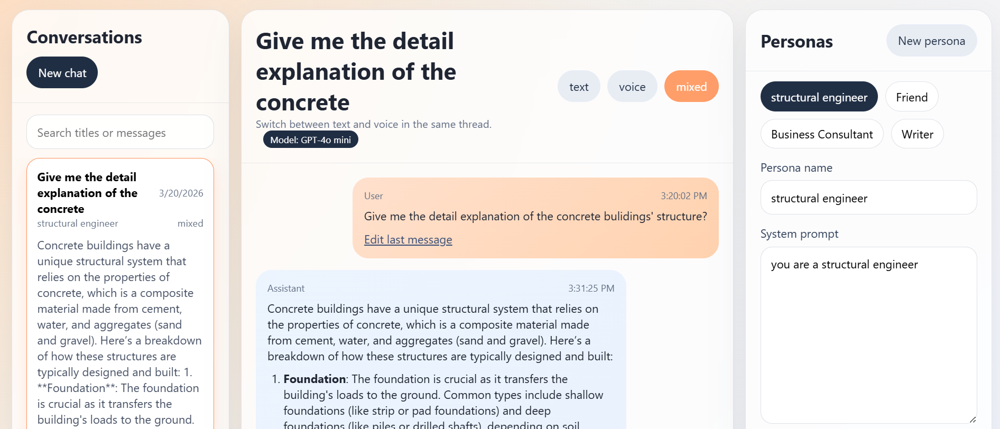
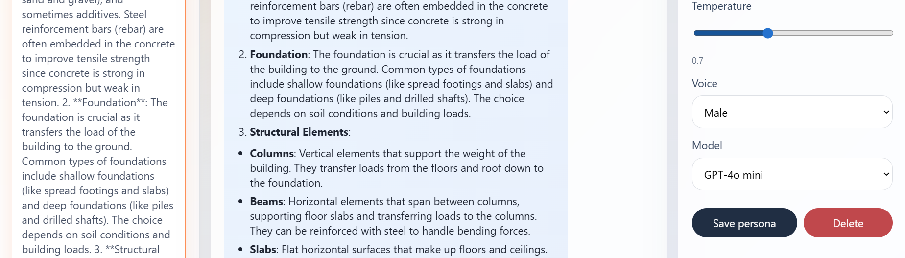
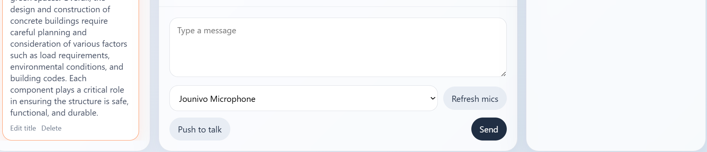

# PersonaTalk

PersonaTalk is a local-first single-user web app for chatting with saved AI personas by text, voice, or mixed mode. It uses a FastAPI backend, a React/TypeScript frontend, SQLite persistence, local Whisper STT, local Kokoro TTS, and selectable LLM providers so you can run cloud, mostly local, or fully local conversation stacks.

<p align="center">
  
  
  
  
</p>

## Features

- Create, save, edit, reuse, and delete personas
- Save, reopen, search, continue, and delete conversations
- Rename conversation titles from the sidebar
- Switch between `text`, `voice`, and `mixed` modes in the same conversation
- Choose the active model per conversation:
  - `GPT-4o mini`
  - `LM Studio Local`
  - `Local GGUF`
- Choose the active microphone from the UI
- Edit the latest user message or transcript and regenerate the reply in place
- Pick male or female Kokoro voice output
- Render assistant replies with lightweight formatting such as bold text, headings, and lists
- Keep persona snapshots and model choice with each conversation
- Return assistant text first in mixed mode, then attach voice output when TTS finishes

## Stack

- Frontend: React, TypeScript, Vite
- Backend: FastAPI, SQLite
- LLM providers:
  - OpenAI `gpt-4o-mini`
  - LM Studio local server
  - Direct GGUF via `llama-cpp-python`
- Speech:
  - STT: `faster-whisper`
  - TTS: `pykokoro`

## Project Layout

- `backend/app/api`: REST endpoints
- `backend/app/services`: orchestration logic
- `backend/app/providers`: LLM, STT, and TTS adapters
- `backend/app/repositories`: SQLite access
- `backend/app/schemas`: request and response models
- `backend/app/data`: SQLite database and cached audio files
- `frontend/src`: React SPA

## Local Setup

### 1. Create a virtual environment

```powershell
python -m venv .venv
.venv\Scripts\Activate.ps1
```

### 2. Install dependencies

App plus local speech:

```powershell
pip install -r requirements.txt
```

Optional direct GGUF stack:

```powershell
pip install -r requirements-local-llm.txt
```

Frontend:

```powershell
cd frontend
npm install
cd ..
```

### 3. Create `.env`

```powershell
Copy-Item .env.example .env
```

### 4. Run the backend

```powershell
uvicorn backend.app.main:app --reload --host 0.0.0.0 --port 8000
```

### 5. Run the frontend

```powershell
cd frontend
npm run dev
```

Open [http://localhost:5173](http://localhost:5173).

## Environment

### OpenAI

```env
OPENAI_API_KEY=
LLM_PROVIDER=openai
LLM_MODEL=gpt-4o-mini
```

### LM Studio Local

```env
LM_STUDIO_BASE_URL=http://127.0.0.1:1234/v1
LM_STUDIO_MODEL=meta-llama-3.1-8b-instruct
```

LM Studio must have:

- a model loaded
- the OpenAI-compatible local server enabled
- port `1234` or your chosen matching port

### Direct GGUF

```env
LLM_PROVIDER=llama_cpp
LLM_MODEL=meta-llama-3.1-8b-instruct
LOCAL_LLM_MODEL_PATH=E:\path\to\model.gguf
LOCAL_LLM_CHAT_FORMAT=
LOCAL_LLM_N_CTX=4096
LOCAL_LLM_N_THREADS=6
LOCAL_LLM_N_GPU_LAYERS=0
LOCAL_LLM_MAX_TOKENS=512
```

Notes:

- `Local GGUF` is fully local inside PersonaTalk
- on this project, it is still CPU-first unless `llama-cpp-python` is rebuilt with GPU support
- on Windows laptops, `LM Studio Local` is usually the simpler local GPU path

### Whisper STT

```env
STT_PROVIDER=whisper
STT_MODEL=base
WHISPER_COMPUTE_TYPE=int8
WHISPER_CPU_THREADS=4
STT_TIMEOUT_SECONDS=180
```

### Kokoro TTS

```env
TTS_TIMEOUT_SECONDS=180
TTS_PROVIDER=kokoro
TTS_MODEL=kokoro-82m
KOKORO_PROVIDER=auto
KOKORO_VOICE_MALE=am_michael
KOKORO_VOICE_FEMALE=af_heart
KOKORO_LANG=en-us
KOKORO_SPEED=0.9
```

Notes:

- if long voice replies time out on your machine, increase `TTS_TIMEOUT_SECONDS` in `.env`
- `.env.example` already includes a safe starting value you can copy and adjust

## Model Modes

### GPT-4o mini

- fastest response quality in normal use
- cloud-hosted
- still uses your local Whisper and Kokoro stack if you leave those enabled

### LM Studio Local

- local inference through LM Studio
- usually the best local-performance choice if your laptop GPU is already working in LM Studio
- requires LM Studio's local server to be reachable

### Local GGUF

- PersonaTalk loads the GGUF file directly
- fully local
- usually slower than LM Studio on a Windows laptop unless direct GPU offload is configured

## Voice Behavior

- Voice input is always stored as text in the conversation
- In `voice` and `mixed` mode, assistant text appears first
- Assistant replies can display lightweight formatting when the model returns structured output
- Kokoro audio is generated in the background and attached to the latest assistant message when ready
- If TTS fails, the latest reply is still kept as text and the UI shows that voice generation did not finish
- Before the first recording, the UI can ask for microphone access so the real device names appear instead of generic labels
- Microphone labels are cleaned up in the UI to show friendlier names such as `Default: ...`, `Communications: ...`, or `Laptop microphone`

## Conversation Behavior

- Each conversation stores:
  - persona snapshot
  - voice preference
  - temperature
  - active LLM provider
  - mode
- Reopening a conversation restores those settings
- Editing the right panel only affects future turns
- Deleting a saved persona does not break old chats because the snapshot stays with the conversation
- The latest user message can be edited and regenerated in place
- The conversation title can be renamed from the sidebar

## UI Summary

- Left panel:
  - conversations
  - search
  - new chat
  - rename title
- Center panel:
  - conversation thread
  - mode toggle
  - message composer
  - edit last message or transcript
  - microphone selector
  - microphone access prompt
  - push-to-talk
  - active model badge
- Right panel:
  - saved personas
  - persona editor
  - temperature slider
  - voice selector
  - model selector

## API Summary

- `GET /api/health`
- `GET/POST/PUT/DELETE /api/personas`
- `GET/POST/PUT/DELETE /api/conversations`
- `GET /api/conversations/{id}/messages`
- `POST /api/messages`
- `POST /api/voice/{conversation_id}`
- `GET /api/audio/{filename}`

## Troubleshooting

### Mixed mode still feels slow

- `GPT-4o mini` text may be fast, but local TTS still has to run afterward
- the UI now shows text first and audio later
- if you want the absolute fastest replies, use `text` mode

### LM Studio fails

Check:

- LM Studio is open
- the local server is enabled
- the model is loaded
- `http://127.0.0.1:1234/v1/models` responds
- `.env` uses the same base URL and model id

### Direct GGUF feels slow

- this is expected when it is CPU-first
- LM Studio is usually faster on Windows laptops with GPU

### Whisper is slow or times out

Try:

- `STT_MODEL=tiny`
- shorter recordings
- lower background CPU load

### Kokoro fails

Check:

- your venv includes the speech dependencies
- the backend was restarted after dependency changes
- if long replies need more time, raise `TTS_TIMEOUT_SECONDS` in `.env`
- if voice generation stalls, the app should now resolve the latest reply as failed instead of staying pending forever

## Practical Notes

- `206 Partial Content` logs for audio playback are normal
- selected microphone and selected model persist across reloads
- if an API key was exposed during development, rotate it
